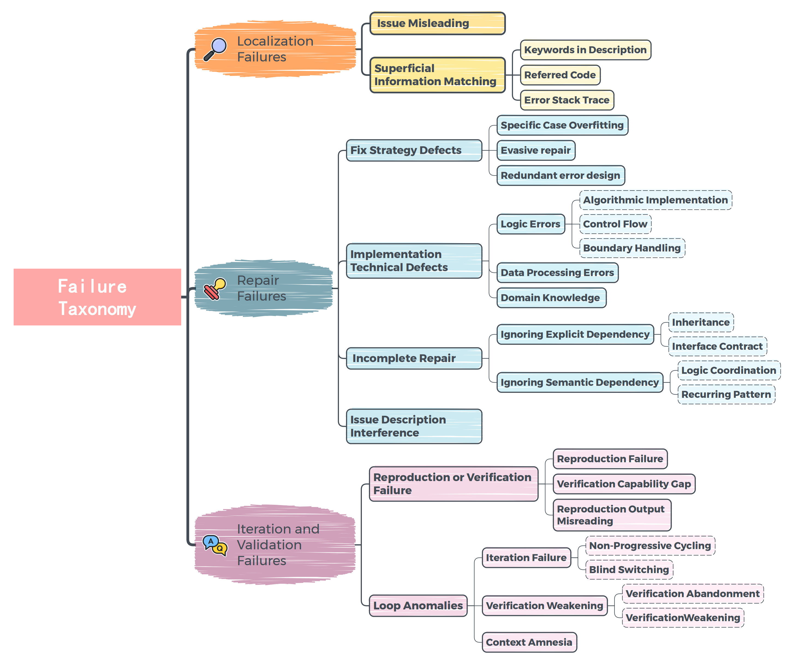
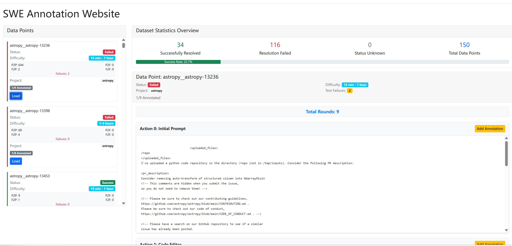
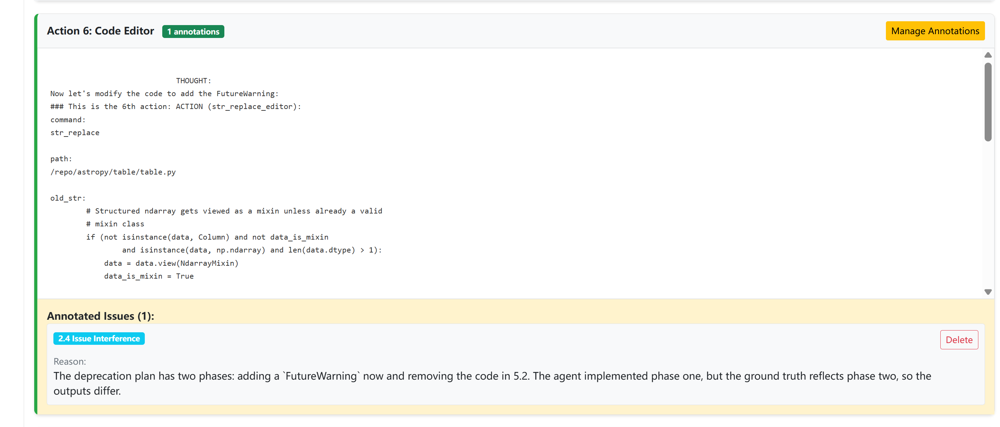

# Why LLM Agents Fail: An Empirical Study on Failures in Automated Issue Solving

This repository contains the implementation and datasets for the paper **"Why LLM Agents Fail: An Empirical Study on Failures in Automated Issue Solving"**, which presents the first comprehensive analysis of failure modes in state-of-the-art LLM-based automated issue solving agents.

## 📖 Abstract

This study conducts an in-depth empirical analysis of failure modes in automated issue solving using three state-of-the-art LLM-based tools: OpenHands, Agentless, and Tools Claude. Through systematic analysis of 150 failed instances from SWE-Bench-Verified, we develop a comprehensive taxonomy of failure modes comprising 3 primary phases, 9 main categories, and 25 fine-grained subcategories. Our findings reveal distinct architectural failure patterns and propose a collaborative Expert-Executor framework that successfully resolves 22.2% of previously intractable issues.

## 🏗️ Repository Structure

```
Why_LLM_Agents_Fail/
├── codebook.pdf                          # Failure mode classification codebook
├── dataset/                              # Annotated failure datasets
│   ├── annotations_agentless.json       # Agentless failure annotations
│   ├── annotations_openhands.json       # OpenHands failure annotations  
│   ├── annotations_tools.json           # Tools Claude failure annotations
│   ├── failure_analysis_viewer.py       # Enhanced visualization tool
│   ├── extracted_log_agentless_points/  # Agentless execution logs
│   ├── extracted_log_openhands_points/  # OpenHands execution logs
│   ├── extracted_log_tools-claude_points/ # Tools Claude execution logs
│   └── templates/                        # Web interface templates
└── Expert-Executor/                           # Expert-Executor implementation
    └── evaluation/benchmarks/swe_bench/
        ├── EXPERT_HYBRID_README.md      # Expert-Executor documentation
        └── EXPERT_HYBRID_PROMPT.md      # Expert collaboration prompts
```

## 📊 Key Findings

### 1. Architectural Failure Patterns
- **Pipeline models** (like Agentless) primarily fail in **localization** (51.3% of failures)
- **Agentic models** (like OpenHands, Tools Claude) fail predominantly in **iteration & validation** 
- Performance degrades consistently as task complexity increases, especially for multi-file modifications

We classify observed failures into a taxonomy with 3 phases, 9 categories, and 25 subcategories.  
**Overview of Failure Taxonomy:**

  


**📋 For detailed classification guidelines and annotation procedures, see the complete [Failure Mode Classification Codebook](codebook.pdf)** - a comprehensive manual containing:
- Detailed definitions for all 25 subcategories
- Annotation examples 

### 2. Root Cause Analysis
- **65%** of failures stem from **flawed reasoning** leading to cognitive deadlocks
- **25%** from **knowledge deficiency** (missing context or domain expertise)  
- **10%** from **environmental friction** (tool usage and setup issues)

## 🛠️ Expert-Executor Framework

Our proposed collaborative architecture addresses the identified failure patterns through:

### Architecture Overview
- **Execution Agent**: Performs standard SWE-Bench workflow with mandatory expert consultation points
- **Expert Agent**: Provides strategic oversight and failure pattern detection
- **Dual Intervention Modes**:
  - *Active Consultation*: Agent requests guidance at critical decision points
  - *Passive Monitoring*: Expert reviews progress and intervenes when failure patterns detected

### Implementation Details
The Expert-Executor framework is implemented as an extension to the OpenHands platform:

- **Core Implementation**: See [`Expert-Executor/evaluation/benchmarks/swe_bench/EXPERT_HYBRID_README.md`](Expert-Executor/evaluation/benchmarks/swe_bench/EXPERT_HYBRID_README.md)
- **Prompt Engineering**: See [`Expert-Executor/evaluation/benchmarks/swe_bench/EXPERT_HYBRID_PROMPT.md`](Expert-Executor/evaluation/benchmarks/swe_bench/EXPERT_HYBRID_PROMPT.md)

### Results
- Successfully resolved **22.2%** of previously failed issues (24/108 cases)
- Outperformed single-agent Claude 4 Sonnet baseline (7/108 cases)  
- Most effective against dominant failure categories: Fix Strategy Defects, Implementation Details, and Verification Failures

#### Successfully Resolved Instances
Our Expert-Executor framework successfully resolved the following 24 previously intractable issues of sample:

```
astropy__astropy-13453     astropy__astropy-14508     django__django-11206
django__django-11239      django__django-12039       django__django-12774  
django__django-13346      django__django-13925       django__django-14534
django__django-14771      django__django-15741       matplotlib__matplotlib-26342
mwaskom__seaborn-3069      pydata__xarray-3095        pydata__xarray-6938
pytest-dev__pytest-6197   pytest-dev__pytest-7490   scikit-learn__scikit-learn-12682
sphinx-doc__sphinx-7889    sympy__sympy-14531         sympy__sympy-15809
sympy__sympy-18211         sympy__sympy-19495         sympy__sympy-24562
```

## 📋 Dataset & Annotations

### Failure Analysis Dataset
We provide manually annotated datasets for all three studied tools:

- **150 systematically sampled failed instances** from SWE-Bench-Verified
- **342 total failure annotations** across three agent architectures
- **Annotation reliability**: Cohen's Kappa 0.72-0.77 (substantial agreement)
- **Comprehensive codebook**: [`codebook.pdf`](codebook.pdf) with detailed annotation guidelines and failure mode definitions

### Data Access
- `annotations_agentless.json` - Agentless failure mode annotations
- `annotations_openhands.json` - OpenHands failure mode annotations  
- `annotations_tools.json` - Tools Claude failure mode annotations
- `extracted_log_*/` - Complete execution traces and test results

## 🖥️ Visualization Tool

### Enhanced Failure Analysis Viewer

We provide an improved tool for exploring the failure data:

```bash
# Basic usage (OpenHands data)
cd dataset
# Different agents Visualization
python failure_analysis_viewer.py --agent tools
python failure_analysis_viewer.py --agent openhands
python failure_analysis_viewer.py --agent agentless
```


### Screenshots

#### Main Dashboard

*Overview of failed issue instances with filtering and test statistics*

#### Detailed Log Analysis
  
*Action-by-action breakdown with failure mode annotation capabilities*

## 🚀 Reproducing Results

### Prerequisites

#### Environment Setup
Follow the OpenHands setup instructions in [`Expert-Executor/evaluation/README.md`](Expert-Executor/evaluation/README.md) for complete environment configuration.

**Basic Requirements:**
- Python 3.8+
- Flask (for visualization tool)
- Docker (for SWE-Bench evaluation environment)

#### LLM Configuration  
Create a `config.toml` file in your OpenHands directory with your LLM settings:

```toml
[llm]
# IMPORTANT: add your API key here, and set the model to the one you want to evaluate
model = "claude-3-5-sonnet-20241022"
api_key = "your-api-key-here"
```

#### Additional Dependencies
```bash
# Install OpenHands in development mode
pip install -e .

# Install evaluation dependencies
pip install -r evaluation/requirements.txt
```

### Running the Visualization Tool
```bash
cd dataset/
python failure_analysis_viewer.py --agent tools
# Navigate to http://localhost:5000
```

### Expert-Executor Evaluation

**Setup Expert-Executor Framework:**
```bash
# Navigate to the Expert-Executor implementation
cd Expert-Executor/evaluation/benchmarks/swe_bench/

# Review setup instructions  
cat EXPERT_HYBRID_README.md
```

**Run Expert-Executor Evaluation:**
```bash
# Basic evaluation with Expert-Executor framework
./scripts/run_infer_expert_hybrid.sh \
  llm.deepseek HEAD CodeActAgent \
  50 40 1 \
  princeton-nlp/SWE-bench_Verified test \
  1 25 10

# Parameters explanation:
# - llm.deepseek: LLM configuration name from config.toml
# - HEAD: Git commit hash  
# - CodeActAgent: Agent class to use
# - 50: Number of instances to evaluate
# - 40: Maximum iterations per instance
# - 1: Number of workers
# - princeton-nlp/SWE-bench_Verified: Dataset
# - test: Dataset split
# - 1: Number of runs  
# - 25: Expert check interval (every 25 iterations)
# - 10: Maximum expert checks per instance
```

**Alternative Configuration:**
```bash
# Using environment variables for configuration
export EXPERT_CHECK_INTERVAL=25
export MAX_EXPERT_CHECKS=10
export ENABLE_EXPERT_REQUESTS=true

python run_infer_expert_hybrid.py \
  --agent-cls CodeActAgent \
  --llm-config llm.deepseek \
  --max-iterations 40 \
  --eval-n-limit 50
```

**For detailed configuration options**, see [`Expert-Executor/evaluation/benchmarks/swe_bench/EXPERT_HYBRID_README.md`](Expert-Executor/evaluation/benchmarks/swe_bench/EXPERT_HYBRID_README.md)


